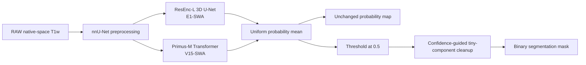

# StrokeFusion: Confidence-Guided Hybrid Segmentation

<p align="center">
  <strong>Official implementation of our ISLES'26 submission</strong><br>
  Native-space ischemic stroke lesion segmentation on T1-weighted MRI
</p>

<p align="center">
  <a href="https://www.python.org/"></a>
  <a href="https://pytorch.org/"></a>
  <a href="https://github.com/MIC-DKFZ/nnUNet"></a>
  <a href="LICENSE"></a>
  <a href="https://grand-challenge.org/algorithms/strokefusion-confidence-guided-hybrid-segmentation/"></a>
</p>

StrokeFusion is a confidence-guided ensemble of a residual-encoder 3D U-Net
and a locally refined Primus-M Transformer. Both members are initialized with
public OpenMind masked-autoencoder weights and trained on the official
ISLES'26 RAW/native-space release. Their foreground probabilities are averaged
uniformly. A conservative confidence-aware cleanup is applied only to the
binary mask; the submitted probability map remains unchanged.

> This repository contains the complete training, evaluation, inference, and
> Grand Challenge packaging code for the submitted algorithm. Licensed data,
> pretrained checkpoints, final weights, and container archives are not stored
> in Git.

## Method



| Component | Frozen specification |
|---|---|
| **E1-SWA** | nnU-Net v2 ResEnc-L, `160 × 192 × 160` patch, OpenMind-MAE initialization, training-only RASS, weight average of epochs 300/350/400 |
| **V15-SWA** | Primus-M, `160³` patch, OpenMind-MAE initialization, low-rank local patch-stem refinement, token-presence auxiliary loss, training-only RASS, weight average of epochs 200/250/300 |
| **Fusion** | Equal foreground-probability average with mirror test-time augmentation |
| **Binary output** | Threshold `0.5`; remove a 6-connected component only when volume `< 0.002 mL` and maximum foreground probability `< 0.65` |

The Transformer refinement is zero-initialized and operates on the native
Primus token grid. It adds an `864 → 64 → 864` local residual path containing
a depthwise `3 × 3 × 3` convolution. A lesion-presence head gates this path and
adds a `0.05`-weighted balanced token-level binary cross-entropy objective to
the standard Dice and cross-entropy segmentation loss.

## Repository layout

```text
configs/                 frozen model and training specifications
docker/                  Grand Challenge inference container
docs/                    method, evaluation, dataset, and submission details
external_models/         expected locations for public OpenMind checkpoints
nnunet_extensions/       custom nnU-Net trainers used by the final method
reproducibility/         frozen inference metadata and expected hashes
results/                 compact local validation summaries
scripts/                 preparation, training, evaluation, and packaging tools
versions/                architecture plans and experiment provenance
```

## Reproduce the final method

### 1. System requirements

- Linux x86-64
- Conda or Miniforge
- Python 3.11
- CUDA-capable NVIDIA GPU; 24 GB VRAM is recommended for the frozen training
  patches and batch sizes
- Docker with NVIDIA Container Toolkit for container testing
- Enough storage for the licensed RAW release and nnU-Net preprocessing cache

The submitted inference container targets an NVIDIA T4 GPU with 16 GB VRAM.

### 2. Clone and create the environment

```bash
git clone git@github.com:KawhiQaQ/ISLES26-StrokeFusion.git
cd ISLES26-StrokeFusion

bash scripts/bootstrap_env.sh isles26
conda activate isles26
```

The concise dependency specification is in `requirements-core.txt`; the
resolved reference environment is retained in `environment.lock.txt`.

### 3. Prepare the licensed RAW data

Download and extract the official ISLES'26/ATLAS R3.0 **RAW** training release.
The standardized/preprocessed archive is not used. Place the extracted folder
at exactly:

```text
data/raw/ATLAS3_Training_Raw/
```

The expected encrypted archive SHA-256 and data inventory are documented in
[`docs/dataset.md`](docs/dataset.md). Do not store the dataset encryption key
in scripts, shell history, Docker layers, or Git.

### 4. Download the public self-supervised initialization

```bash
hf download MIC-DKFZ/ResEncL-OpenMind-MAE checkpoint_final.pth \
  --local-dir external_models/ResEncL-OpenMind-MAE

hf download MIC-DKFZ/PrimusM-OpenMind-MAE checkpoint_final.pth \
  --local-dir external_models/PrimusM-OpenMind-MAE
```

Expected paths and hashes:

| Initialization | Local path | SHA-256 |
|---|---|---|
| ResEnc-L OpenMind-MAE | `external_models/ResEncL-OpenMind-MAE/checkpoint_final.pth` | `7a847af785635335c00e711d16ff4d225d86ecd5992b14c059df2b520e3ee933` |
| Primus-M OpenMind-MAE | `external_models/PrimusM-OpenMind-MAE/checkpoint_final.pth` | `b866ac5f61d7e90d3a6cbb00a759ffc9d73beb5e63baa6b3cd654671ebc9a552` |

These checkpoints were pretrained without labels on the OpenMind/OpenNeuro
brain-MRI collection. They are not derived from the ISLES validation or test
sets.

### 5. Generate the frozen split and preprocess

```bash
bash scripts/run_v1.sh setup
bash scripts/run_v1.sh plan
bash scripts/run_v1.sh preprocess
```

`setup` deterministically rebuilds the center-grouped five-fold split from the
licensed release. The expected split SHA-256 is:

```text
da10108f65fdff2954c7f68f9e69456a5d9bb8f78b28512e3714656ba2bd9885
```

Generated manifests and patient-level split files remain local and are ignored
by Git.

### 6. Train both full-data members

```bash
bash scripts/run_full_final.sh
```

The script performs the complete frozen procedure:

1. train V12/ResEnc-L for 400 epochs on fold `all`;
2. average checkpoints 300, 350, and 400 into E1-SWA;
3. train V15/Primus-M for 400 epochs on fold `all`;
4. average checkpoints 200, 250, and 300 into V15-SWA;
5. persist both verified models under `outputs/final_full_models/`.

Training is resumable from each member's `checkpoint_latest.pth`. The final
checkpoints must match:

| Model | Output | SHA-256 |
|---|---|---|
| E1-SWA | `outputs/final_full_models/checkpoint_E1_swa.pth` | `b974c29405011d4ddcb1850544c6d6fc054cc39544d3ada99b4b2808db88647b` |
| V15-SWA | `outputs/final_full_models/checkpoint_V15_swa_e200_e250_e300.pth` | `98429330ea0e800d0ce9d38b446494343fdaeba04c7e83caa6a50ff032dc05d2` |

## Released weights

The download cells will be filled after the final weights are uploaded to
Baidu Netdisk.

| Artifact | Download | Extraction code | SHA-256 |
|---|---|---|---|
| E1-SWA checkpoint |  |  | `b974c29405011d4ddcb1850544c6d6fc054cc39544d3ada99b4b2808db88647b` |
| V15-SWA checkpoint |  |  | `98429330ea0e800d0ce9d38b446494343fdaeba04c7e83caa6a50ff032dc05d2` |
| Grand Challenge Model resource |  |  | `06c159dce3059f319f916d264c78b2b5e76e29456f91f907077c50520446ffd6` |

When the Model resource is available, place it at
`submission_artifacts/model-postprocess.tar.gz` and restore the two checkpoint
files with:

```bash
bash scripts/restore_final_models.sh
```

### Verify the frozen release

After downloading all licensed and released artifacts:

```bash
bash scripts/verify_final_release.sh
```

The verifier checks the RAW archive, generated split, public initialization,
container/model resources, embedded checkpoint hashes, threshold, and frozen
postprocessing contract.

## Grand Challenge inference container

The container follows the official ISLES'26 `invoke` interface. It accepts a
native-space T1 MRI and stroke metadata and returns both the binary lesion mask
and float probability map in the original geometry. Metadata is accepted for
interface compatibility but is not used by the model.

```bash
# Build the linux/amd64 algorithm image.
cd docker
bash do_build.sh

# Place a local test case under docker/test/input/, then run with NVIDIA Docker.
bash do_test_run.sh

# Export the algorithm image and separate Model resource.
bash do_save.sh
```

See [`docker/README.md`](docker/README.md) and
[`docs/submission.md`](docs/submission.md) for the exact input/output sockets,
resource limits, and packaging contract.

## Evaluation

The evaluation code implements Dice, lesion F1, PR-AUC, absolute volume
difference, and absolute lesion-count difference:

```bash
python scripts/evaluate_isles26.py --help
python scripts/evaluate_probability_ensemble.py --help
```

The retained fold-0 Rule-2 comparison is available in
[`results/fold0_rule2.csv`](results/fold0_rule2.csv). The two published
Preliminary cases are recorded in
[`results/preliminary_metrics.json`](results/preliminary_metrics.json); they
are used only as a container sanity check, not for model selection.

## Reproducibility notes

- Supervised training uses only the official RAW release.
- Center identity, days post stroke, and chronicity are not model inputs.
- RASS is training-only and does not modify the inference graph.
- The two ensemble weights, threshold, and cleanup criteria are fixed.
- The probability map is never altered by binary-mask postprocessing.
- Complete immutable hashes and restoration instructions are in
  [`docs/reproducibility.md`](docs/reproducibility.md).

## References

- Wald et al., [An OpenMind for 3D Medical Vision Self-Supervised Learning](https://arxiv.org/abs/2412.17041), 2024.
- Wald et al., [Revisiting MAE Pre-training for 3D Medical Image Segmentation](https://arxiv.org/abs/2410.23132), 2024.
- Wald et al., [Primus: Enforcing Attention Usage for 3D Medical Image Segmentation](https://arxiv.org/abs/2503.01835), 2025.
- Isensee et al., [nnU-Net Revisited: A Call for Rigorous Validation in 3D Medical Image Segmentation](https://arxiv.org/abs/2404.09556), 2024.

Citation information for the ISLES'26 challenge manuscript will be added after
publication.

## License and data use

The source code is released under the [Apache License 2.0](LICENSE). The
ISLES/ATLAS data are governed by their own terms and are not redistributed.
Public pretrained checkpoints remain subject to their upstream licenses.
